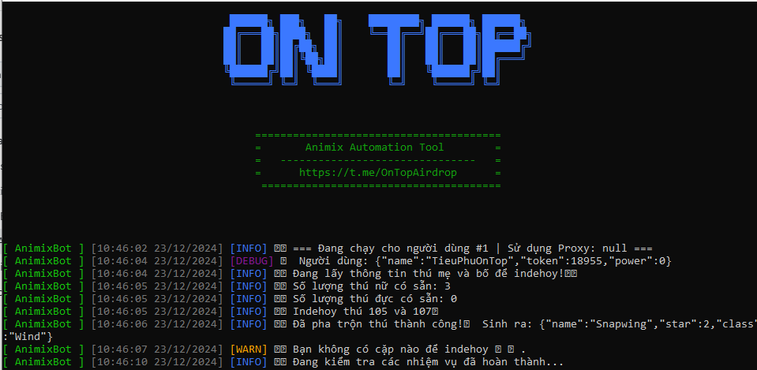
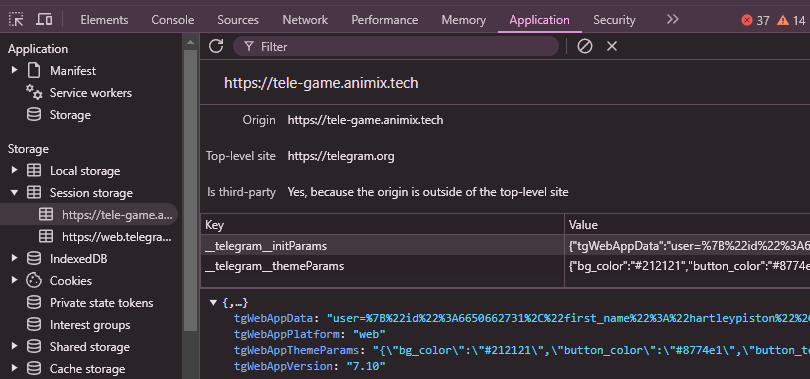

## Animix telegram miniapp bot


This script automates various tasks for the Animix miniapp telegram.

## Features

- **Auto Join/Claim Missions**
- **Auto Gatcha New Pets**
- **Auto Complete Quests**
- **Auto Merge Pets**
- **Auto Claim Rewards**
- **Support Multy accounts**
- **Support Proxy Usage**

## Prerequisites

- Node.js installed on your machine
- `data.txt` file containing user data follow instruction below to get:
- Open Animix miniapp telegram [https://t.me/animix_game_bot](https://t.me/animix_game_bot?startapp=XDeLzPLGeYEI)
- inspect or just F12 find application
- in session storage find `tgWebAppData` and copy all value. `user=....`


## Installation

1. Clone the repository:
    ```sh
    git clone https://github.com/nongdancryptos/animix.git
    cd animix
    ```

2. Install the required dependencies:
    ```sh
    npm install
    ```
3. Input your user data in `data.txt` file, one user per line;
    ```sh
    nano data.txt
    ```
4. optionally you can use proxy: 
- paste proxy in `proxy.txt` format `http://username:password@ip:port` 
    ```sh
    nano proxy.txt
    ```
5. Run the script:
    ```sh
    npm run start
    ```
- ## Donations
If you would like to support the development of this project, you can make a donation using the following addresses:

- **Solana**: `3rYhoVL8g28iwjGQq8hKw4bvVmBGhyC8DEbKAwzmy4wn`
- **EVM**: `0x431588aff8ea1becb1d8188d87195aa95678ba0a`
- **BTC**: `bc1pu30mhlegcajqq23ff30vrlnlnsmv0ha6ufwaenv0em4ap8dfzyrqwsvjx5`
- Chúng tôi rất vui được chia sẻ các mã script và tài nguyên mã nguồn miễn phí đến cộng đồng làm airdrop. Nếu bạn thấy các công cụ và tài liệu của chúng tôi hữu ích và muốn ủng hộ chúng tôi tiếp tục phát triển và duy trì các dự án này, bạn có thể đóng góp hỗ trợ qua hình thức donate.
- Mỗi đóng góp của bạn sẽ giúp chúng tôi duy trì chất lượng dịch vụ và tiếp tục cung cấp những tài nguyên giá trị cho cộng đồng làm airdrop. Chúng tôi chân thành cảm ơn sự hỗ trợ và ủng hộ của bạn!
# Cảm ơn bạn 😘😘😘

<div style="display: flex; gap: 20px;">
  
  
</div>

## Contributing

Feel free to open issues or submit pull requests if you have improvements or bug fixes.

# WARNING
⚠️ "User assumes all responsibility and risk associated with the use of this bot/program script."

## 

This project is licensed under the [MIT License](LICENSE).
